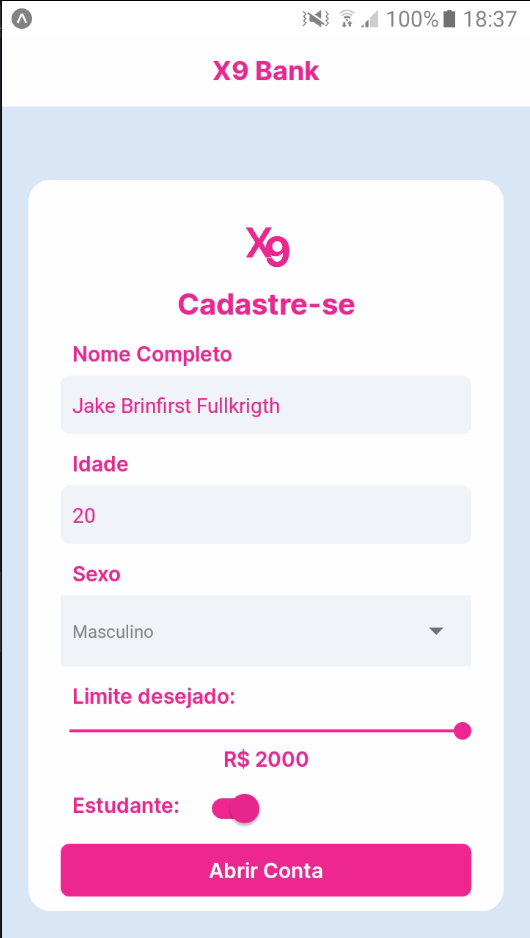

# App - X9 Bank

Esse projeto faz de forma simples uma idealização de um formulário de cadastro para um aplicativo de um Banco.

Projeto desenvolvido para: **Mobile**

_Tecnologias_ Utilizadas: **_React Native_**

## * Como iniciar o projeto

### * Requisitos:

* **Node.js v18.12.1**
* Celular com App **Expo Go** instalado
     **_ou_**
* Emulador Android - **Android Studio**

### * Sequência:

* 1- Abra o seu terminal e clone o projeto
  `$ git clone https://github.com/thiagothree/x9-bank.git`
* 2- Instale as dependências do projeto:
  `npm install`
* 3- Inicie o servidor:
  `npx expo start`
* 4- Depois que o terminal concluir, decida se vai usar o emulador do android studio ou o Expo Go e leia o QR Code.

### Screenshots

#### * Tela inicial

